# Antenna Array Designers for MATLAB

Two interactive MATLAB desktop apps for exploring planar antenna arrays. **Phased Array Designer** models a driven array with steerable element excitations. **Reflectarray Designer** models a passive, phase-only reflecting surface illuminated by a horn or plane wave. Both show geometry, phase, and radiation-pattern views; they are separate apps and do not alter one another.

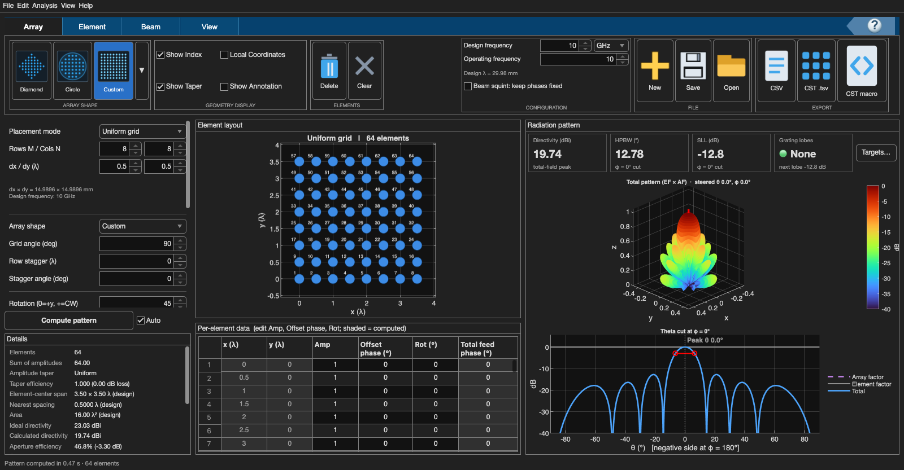

**Phased Array Designer at a glance.** The Array, Element, and Beam controls define a driven aperture. The center shows active elements and their editable table; directivity metrics, a 3D radiation pattern, and a 2D cut appear on the right. The values shown are one example design.

## Start here

You need MATLAB with its desktop interface. The apps were developed and checked with **MATLAB R2025b**; other releases have not been verified. MATLAB Online and MATLAB Runtime have not been tested.

1. Download this repository using **Code → Download ZIP** on GitHub, or clone it with Git.
2. Open MATLAB and change the **Current Folder** to `phased-array` or `reflectarray` in the downloaded repository.
3. Run one of these commands in the MATLAB Command Window:

   ```matlab
   phasedArrayDesigner
   ```

   ```matlab
   reflectarrayDesigner
   ```

To share an app, send its main `.m` file: `phased-array/phasedArrayDesigner.m` or `reflectarray/reflectarrayDesigner.m`. Each includes the icons and calculations it needs, so the recipient can put the file in any MATLAB folder and run its function. The optional **Phased Array Designer.mlappinstall** adds a phased-array app tile in the MATLAB Apps gallery.

## Choose an app

| | Phased Array Designer | Reflectarray Designer |
|---|---|---|
| Excitation | Driven array elements | Horn or incident plane wave reflected by a surface |
| Main controls | Array shape, element pattern, amplitude/phase, steering | Surface shape, feed/incidence, reflection phase, target beam |
| Results | 3D and 2D patterns, phase map, scan analyses, CST comparison | Geometry, four-term phase map, illumination map, 3D and 2D patterns, frequency sweep |
| Project files | MATLAB `.mat` design | MATLAB `.mat` reflectarray project |

Follow the [phased-array walkthrough](docs/phased-array-guide.md) or [reflectarray walkthrough](docs/reflectarray-guide.md) for a first experiment. The [screenshot gallery](docs/screenshots/README.md) shows the main controls and result views in both apps. The [model and coordinate notes](docs/model-and-coordinates.md) explain how to interpret angles, dB plots, and the differences between the two calculations.


**Reflectarray Designer at a glance.** The blue reflecting cells lie in the z = 0 plane and face +z; the yellow horn marks an illuminating feed above them. Click a cell to inspect or edit it. No cell is selected when the app opens.

## Explore Phased Array Designer

The app combines an array factor with a selected element response. Its plots let you inspect the full pattern, isolate the array factor, and check how steering behaves over angle and frequency.

### Steered beam and 2D cuts

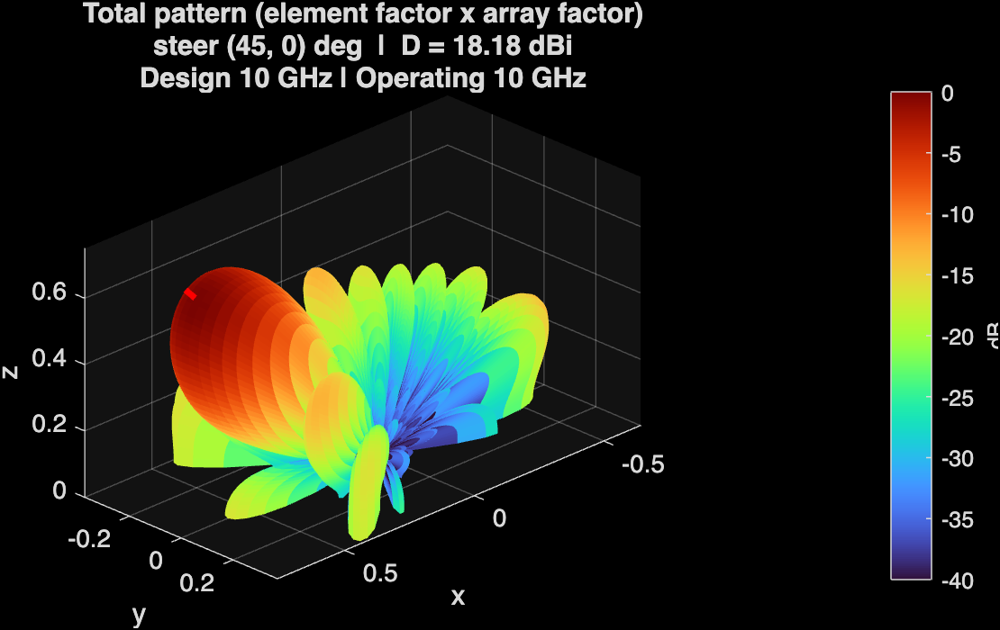

**Steered 3D pattern.** The main lobe moves away from the +z array normal when the commanded direction changes. The smaller lobes are other directions in which the modeled array radiates.

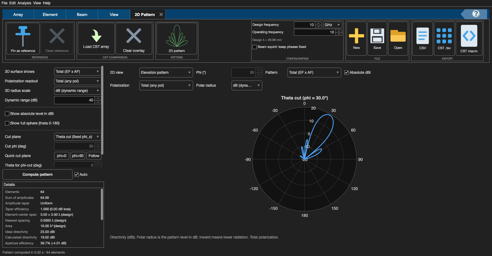

**Steered 2D cut.** A cut samples one plane of the 3D pattern. Its plane can follow the commanded beam phi or be set independently. Polar/Cartesian and relative/absolute-dBi choices change the presentation, not the underlying field.

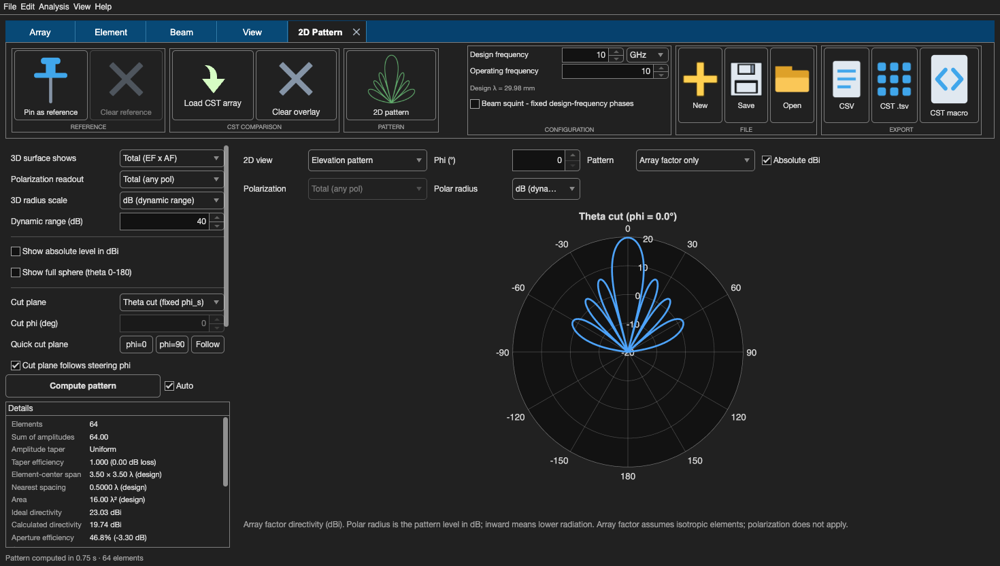

**Array factor only.** This view isolates the interference caused by element positions and excitations. Comparing it with the total pattern reveals how the selected single-element response reshapes the lobes.

### Excitation and scan analyses

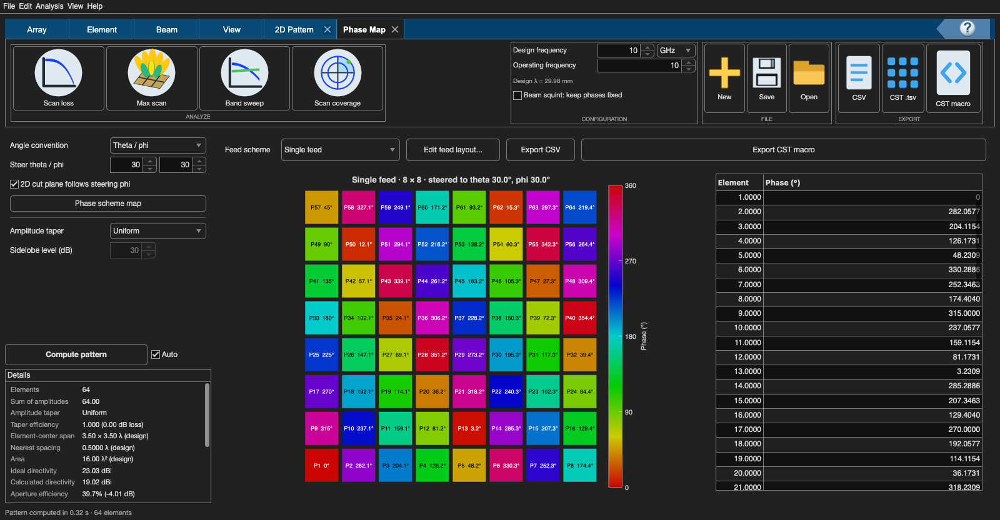

**Phase map.** Each driven cell's excitation phase contributes to beam steering. The map and table show individual values and allow element-level editing.

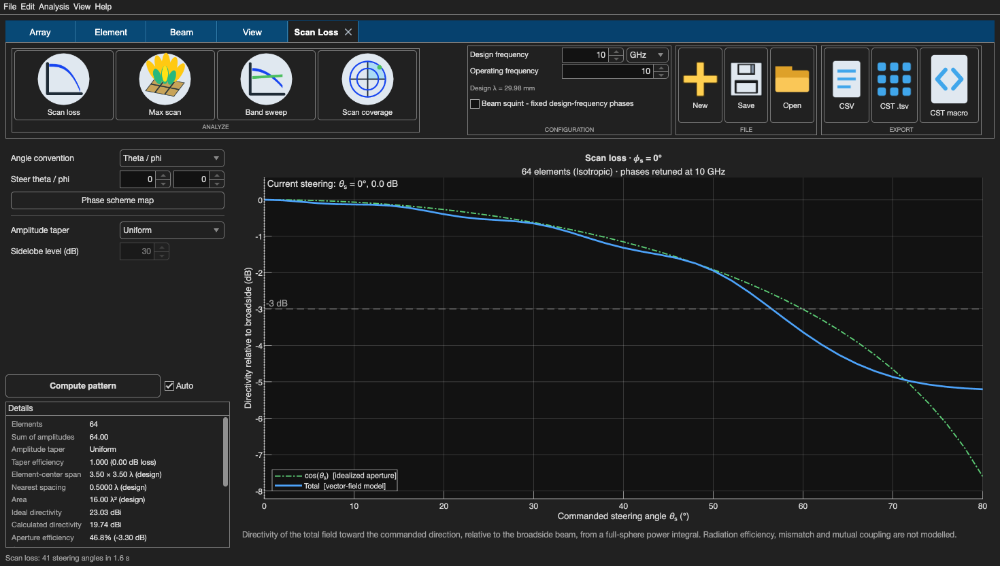

**Scan loss.** Directivity in commanded directions is compared with a broadside reference. It shows how the chosen aperture and element pattern limit useful steering range.

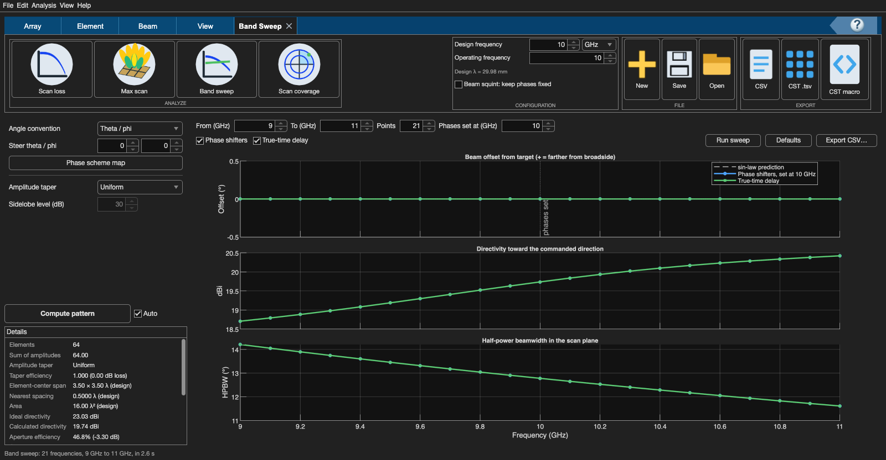

**Band sweep.** The graphs track beam offset, directivity, and half-power beamwidth across frequency. Fixed-phase steering can be compared with true-time delay; an off-broadside beam makes frequency-dependent pointing changes easier to see.

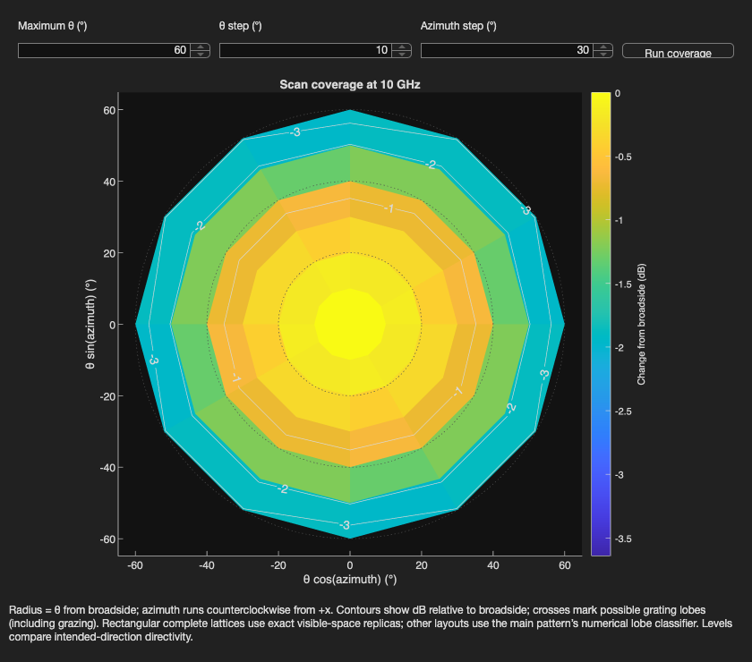

**Coverage.** This map checks scan performance across a two-dimensional region of commanded theta and phi. A single 2D cut can miss poor behavior elsewhere in that region.

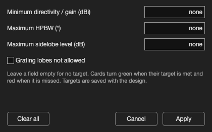

**Targets.** Optional directivity, beamwidth, sidelobe, and grating-lobe criteria help evaluate a design. These are user-selected model thresholds, not measured tolerances.

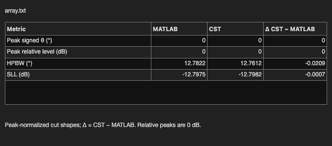

**CST comparison.** With compatible CST data, the app compares its calculated cut and metrics with imported array results. CST workflows are optional; the app does not run a full-wave simulation itself.

The [phased-array walkthrough](docs/phased-array-guide.md) provides a first experiment, and the [model and coordinate notes](docs/model-and-coordinates.md) explain the conventions behind its plots.

## Explore Reflectarray Designer

The app computes incident spatial phase, assigns reflection phases for an intended outgoing beam, and sums a scalar field model. The following views separate illumination, phase, and radiation behavior.

### Source and aperture maps


**Plane-wave illumination.** Switching the source replaces the horn drawing with one red incoming wavefront and a propagation arrow. Incidence theta and phi set its direction; theta = 0° means normal incidence.


**Phase map.** The four panels show incident spatial phase, desired outgoing progressive phase, assigned cell-reflection phase, and a continuous-aperture reference. Reflection phase compensates the incoming path phase while steering the outgoing field; manual cell edits can change the assigned map.


**Illumination map.** Incident amplitude shows how strongly the source reaches each active cell. Effective amplitude includes any optional mathematical taper. Phase compensation does not flatten the horn's amplitude variation.

### Radiation patterns and cuts

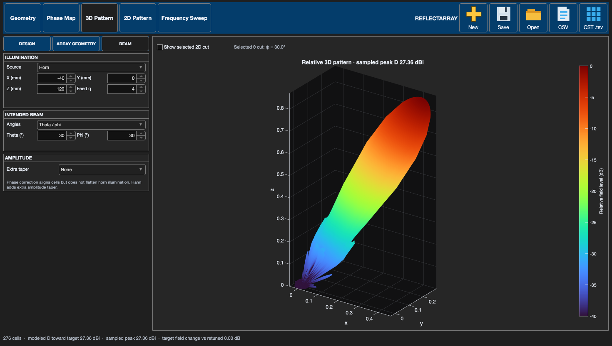

**3D pattern.** The surface shows modeled relative field over the forward hemisphere. Its main and side lobes show radiation in different directions.


**Selected cut on 3D.** The highlighted curve marks where the selected theta or phi cut intersects the 3D pattern. A lobe outside that slice can appear in 3D but not in the 2D view.


**2D pattern.** A theta cut varies theta at a selected phi; **Follow beam** uses the intended beam's phi. A phi cut varies phi at a fixed theta. Choose Polar or Cartesian, and optionally show modeled absolute directivity in dBi instead of peak-relative dB.

### Frequency behavior


**Frequency sweep.** Cell-reflection phases stay fixed while operating frequency changes. The upper graph compares modeled directivity at the commanded direction and sampled peak; the lower graphs show the peak's theta and phi. Unit-cell dispersion and loss are not included.

Follow the [reflectarray walkthrough](docs/reflectarray-guide.md) to reproduce these views and edit cells. The [model and coordinate notes](docs/model-and-coordinates.md) explain phase and directivity conventions.

## Requirements and limits

Core features of both apps use MATLAB. In Phased Array Designer, **Chebyshev** and **Taylor** tapers additionally use Signal Processing Toolbox; the app falls back to Uniform if it is unavailable. CST Studio Suite is optional and is needed only for CST data workflows.

The plots are models, not a substitute for full-wave simulation or antenna measurement. The phased-array app can use analytic or imported element patterns. The reflectarray app uses a scalar, phase-only surface model and does not predict unit-cell dispersion, reflection loss, feed spillover, coupling, polarization, or realized gain. Its optional Hann taper is a mathematical amplitude experiment, not a capability of a phase-only cell.

## Files and checks

- [`phased-array/`](phased-array/) contains the self-contained MATLAB source, an optional MATLAB installer, and focused checks. Only `phasedArrayDesigner.m` is needed to run the app.
- [`reflectarray/`](reflectarray/) contains the self-contained MATLAB source, separate calculation helpers and icons for development, and its numerical/UI regression suite. Only `reflectarrayDesigner.m` is needed to run the app.
- [`docs/screenshots/`](docs/screenshots/README.md) contains annotated screenshots of the controls, geometry, phase and illumination maps, 2D and 3D patterns, and frequency analyses.

From each app folder in MATLAB, run `testPhasedArrayDesigner2D`, `testPhasedArrayDesignerShapes`, or `testPhasedArrayDesignerElementReference` for focused phased-array checks, and `testReflectarrayDesigner` for reflectarray numerical and UI checks. These checks require the desktop UI.

Copyright © 2026 Muhammed Said Gökdöl. **All rights reserved.** This repository [does not grant a software reuse license](COPYRIGHT.md).
