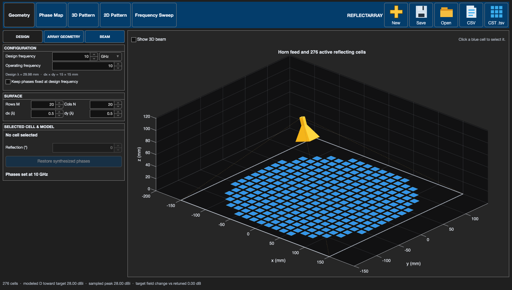
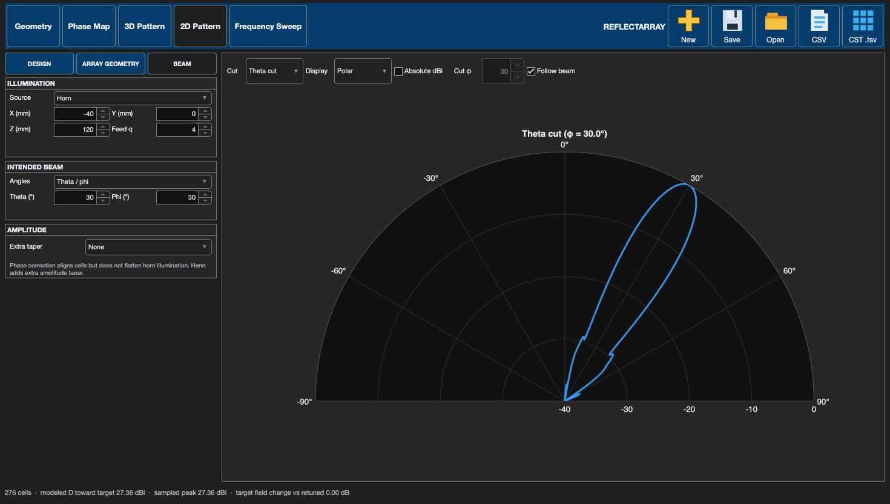
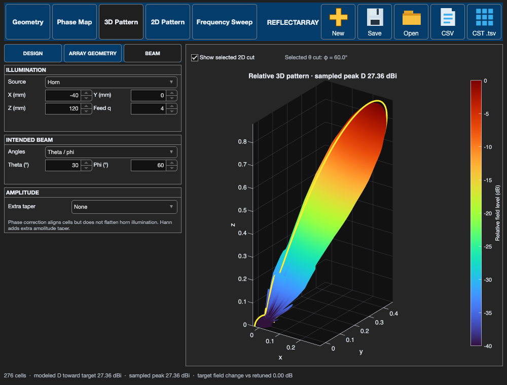
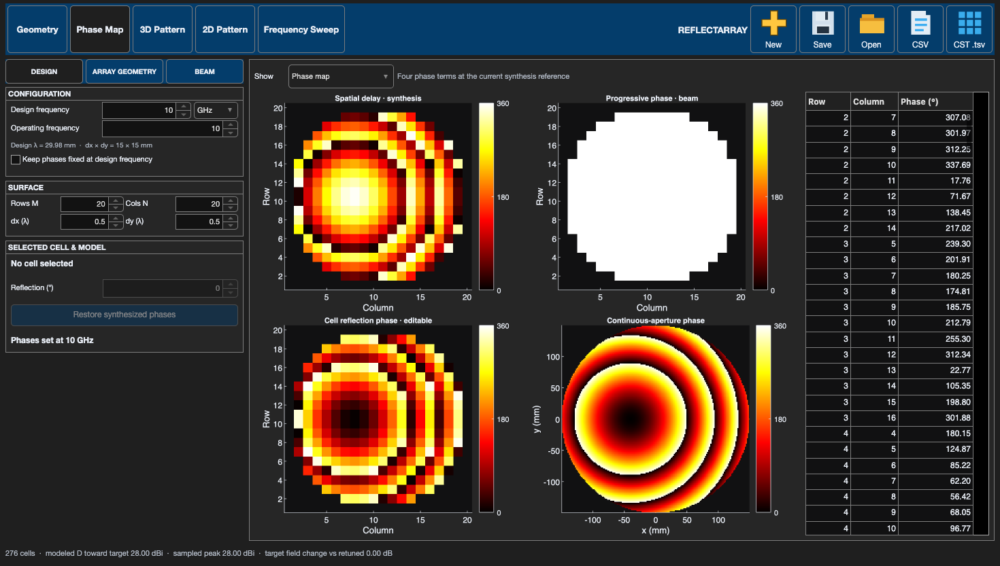
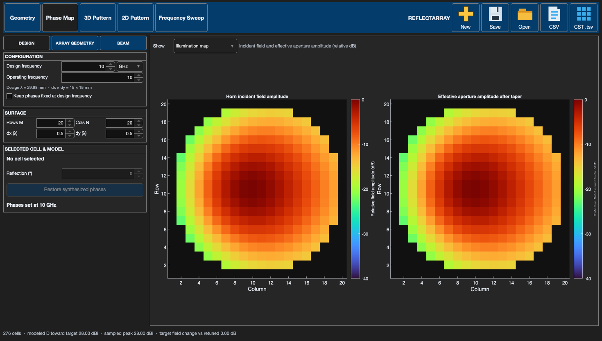
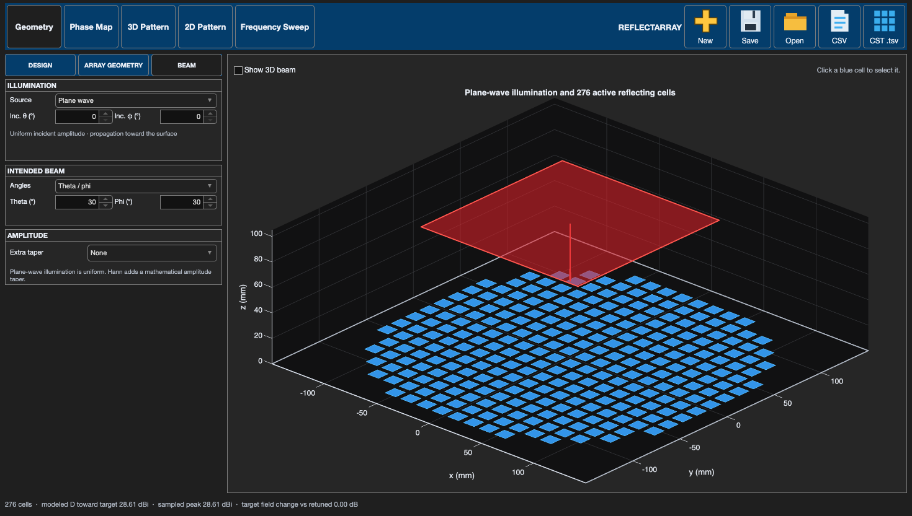
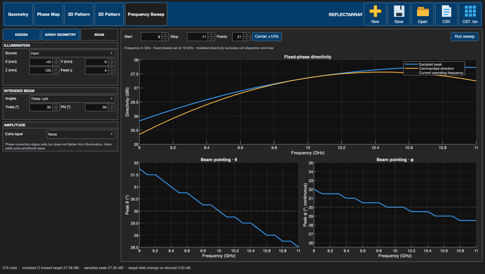

# Reflectarray Designer: first experiment

## Open the app

Use MATLAB R2025b with its desktop interface. Put `reflectarrayDesigner.m` in your MATLAB Current Folder and enter `reflectarrayDesigner`. This one file includes its icons and calculation helpers. The app opens with **no cell selected**; click a blue cell in Geometry or a cell in the Phase Map to edit it.

The default is a 20 × 20 lattice trimmed to a circle, with dx = dy = 0.5 design wavelengths. Its reflecting cells lie at z = 0 and face +z. A yellow horn at (−40, 0, 120) mm illuminates the surface; the intended beam begins at broadside.

## Try a beam-steering change

1. In **Design**, set the design and operating frequencies, row/column counts, and dx/dy in wavelengths. Design frequency determines physical cell spacing; changing operating frequency does not move the cells.
2. In **Beam → Illumination**, leave **Horn** selected and adjust its X/Y/Z phase-center coordinates if desired. **Intended Beam** sets the target θ/φ or elevation/azimuth. Try θ = 30° and φ = 30°.
3. Open **3D Pattern** to see the modeled reflected beam. In **2D Pattern**, choose a **Theta cut** at the target φ. **Follow beam** updates that fixed cut plane as the beam φ changes. Uncheck it and set **Cut φ** to inspect another plane. A **Phi cut** instead sweeps φ at a fixed **Cut θ**.
4. Switch between **Polar** and **Cartesian**. **Absolute dBi** displays modeled directivity; without it, the curve is peak-relative dB. **Show selected 2D cut** overlays the current cut on the 3D view when you want to see where that slice crosses the full pattern.

To see where that cut passes through the full 3D pattern, check **Show selected 2D cut** on the 3D Pattern view. The highlighted curve is the chosen cut, not a second independently calculated beam:

## See why phases and illumination differ

Open **Phase Map**. Its **Show** menu has two choices:

- **Phase map** compares incident spatial phase, outgoing progressive phase, assigned cell-reflection phase, and a dense continuous-aperture reference. The assigned map can differ after you manually edit cells.
- **Illumination map** shows incident field amplitude and effective aperture amplitude after optional taper, each in dB relative to its brightest active cell.

The synthesized phase compensates the horn's different path lengths. It **does not flatten** the horn's amplitude variation across the surface. In **Beam → Illumination**, switch to **Plane wave** to compare with uniform incident amplitude. At normal incidence, θ = 0°. The horn drawing becomes one red incoming wavefront in Geometry. **Extra taper** can apply a mathematical Hann amplitude weighting, but a phase-only physical cell cannot impose that weighting independently.

## Edit geometry and phases

The **Array Geometry** section contains a shape dropdown with Custom (full grid), Diamond, Hexagon, Octagon, Circle, and Ellipse. Grid angle skews the lattice; row stagger offsets alternating rows. Click cells in Geometry or the Phase Map; Shift/Command-click or phase-table row selection allows multiple-cell edits. Move selected cells, reset them to the lattice, delete them, or undo the last deletion. Clicking an empty Phase Map position restores that cell. In **Design**, an active selected cell's **Reflection (°)** control edits its phase; **Restore synthesized phases** returns the whole surface to the calculated phase law.

## Compare frequency behavior

**Frequency Sweep** holds the assigned reflection phases fixed while changing operating frequency. Set Start, Stop, and Points, then press **Run sweep**. The upper plot shows modeled directivity at the commanded direction and at the sampled peak. Lower plots show the sampled peak's θ and φ. **Center ±10%** sets a range around the current operating frequency. This is a phase-only propagation experiment: it omits frequency-dependent unit-cell reflection and loss.

Use **New/Save/Open** for `.mat` projects. **CSV** exports cell coordinates, illumination amplitude, and phase values. **CST .tsv** is an *equivalent driven aperture* export; it is not a physical CST horn-and-reflector model. Run `testReflectarrayDesigner` from the `reflectarray` folder to execute numerical checks and a UI smoke test.

The app's dBi output is directivity of its idealized, forward-only scalar reflected field, not realized antenna gain. See [model and coordinate notes](model-and-coordinates.md) before comparing it directly with a phased-array result.

[Browse all app screenshots](screenshots/README.md) for examples of every principal result view.
